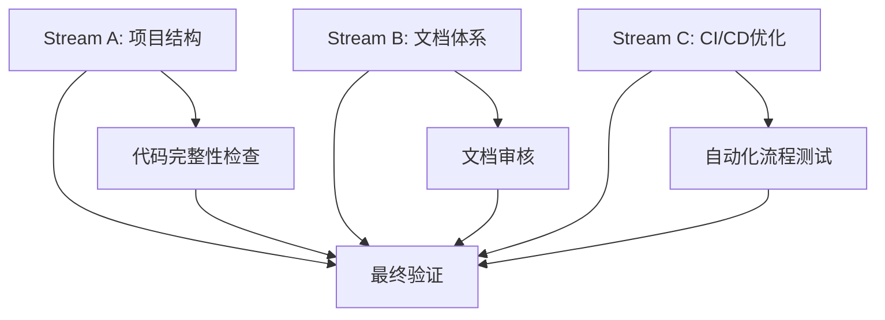

# Issue #3 - 项目初始化与环境配置分析

## 任务概述

**Issue #3** 专注于史诗AI项目的基础开发环境建立，包括代码仓库初始化、开发工具配置和基础项目结构设置。

### 当前状态评估

经过分析，发现项目中**大部分配置已经完成**，项目初始化工作已经进入后期阶段。

### 已完成的配置项 ✅

- ✅ Next.js 14.2.3 已安装并配置
- ✅ TypeScript 5.4.5 环境就绪
- ✅ Tailwind CSS 3.4.3 样式框架配置完成
- ✅ package.json 包含完整的脚本定义
- ✅ ESLint + Prettier 代码质量工具已配置
- ✅ Husky + lint-staged Git hooks 已设置
- ✅ GitHub Actions 工作流已配置
- ✅ 项目基础目录结构已建立
- ✅ 环境变量模板已创建
- ✅ 测试框架 (Jest + Testing Library) 已配置

### 需要完善的项目 ⚠️

- ⚠️ 部分源代码文件结构需要完善
- ⚠️ 文档内容需要更新和补充
- ⚠️ CI/CD管道需要测试验证

## 并行工作流分解

基于当前状态，可以将剩余任务分解为**3个并行工作流**：

### Stream A: 项目结构完善与代码库整理

**负责范围**: 项目目录结构优化、源代码文件整理、类型定义完善

**工作内容**:

1. 完善src目录结构
   - `src/types/` - TypeScript类型定义
   - `src/lib/` - 工具函数库
   - `src/components/` - UI组件库
   - `src/app/` - Next.js App Router页面

2. 创建标准项目文件夹
   - `docs/` - 项目文档
   - `scripts/` - 构建脚本
   - `tests/` - 测试文件组织

3. 类型系统完善
   - API响应类型定义
   - 组件Props接口
   - 全局常量类型

**预估工作量**: 2-3小时
**并行安全**: ✅ 完全独立，无依赖冲突

### Stream B: 文档体系建立与规范化

**负责范围**: 项目文档创建、开发指南编写、README优化

**工作内容**:

1. 核心文档创建
   - `README.md` 更新为史诗AI项目专用
   - `CONTRIBUTING.md` 贡献指南
   - `CHANGELOG.md` 变更日志完善

2. 开发文档
   - API文档结构
   - 组件使用指南
   - 部署说明文档

3. 代码规范文档
   - ESLint规则说明
   - Git提交规范
   - 代码审查清单

**预估工作量**: 2-3小时
**并行安全**: ✅ 独立文档工作，无代码依赖

### Stream C: CI/CD与开发工具优化

**负责范围**: 持续集成优化、开发环境验证、自动化流程测试

**工作内容**:

1. GitHub Actions工作流验证
   - 测试自动化流程
   - 构建验证流程
   - 代码质量检查流程

2. 开发环境验证
   - Node.js版本兼容性测试
   - 依赖安装完整性检查
   - 开发服务器启动验证

3. 自动化工具优化
   - Prettier格式化规则调优
   - Husky hooks脚本优化
   - 测试覆盖率配置

**预估工作量**: 1-2小时
**并行安全**: ✅ 独立配置工作，可并行进行

## 工作流依赖关系

**依赖分析**:

- **无硬依赖**: 3个工作流可以完全并行执行
- **最终整合**: 所有工作流完成后需要进行集成测试
- **轻量级协调**: 通过Git commit进行进度同步

## 并行执行策略

### Agent分配建议

1. **Agent 1 - 代码架构师**
   - 专长: TypeScript、项目结构、组件设计
   - 负责: Stream A - 项目结构完善
   - 工作模式: git worktree `stream-a-structure`

2. **Agent 2 - 技术文档工程师**
   - 专长: Markdown、文档结构、技术写作
   - 负责: Stream B - 文档体系建立
   - 工作模式: git worktree `stream-b-docs`

3. **Agent 3 - DevOps工程师**
   - 专长: CI/CD、自动化、环境配置
   - 负责: Stream C - CI/CD优化
   - 工作模式: git worktree `stream-c-cicd`

### 协调机制

1. **进度同步**: 每个agent在`.claude/epics/ai/updates/`创建进度文件
2. **冲突避免**: 通过文件路径分离确保无冲突
3. **集成验证**: 主线程负责最终集成测试

## 预估工作量

| 工作流               | 估时        | 风险等级 | 依赖复杂度 |
| -------------------- | ----------- | -------- | ---------- |
| Stream A - 项目结构  | 2-3小时     | 低       | 低         |
| Stream B - 文档体系  | 2-3小时     | 低       | 低         |
| Stream C - CI/CD优化 | 1-2小时     | 中       | 中         |
| **总计**             | **5-8小时** | -        | -          |

## 风险评估与缓解策略

### 低风险项 ✅

- **项目结构完善**: 基于现有结构，风险极低
- **文档创建**: 独立工作，无技术风险

### 中等风险项 ⚠️

- **CI/CD流程**: 需要实际测试验证，可能需要调试

### 缓解策略

1. **渐进式验证**: 每个工作流独立测试后再集成
2. **回滚准备**: 保持当前配置备份
3. **分阶段提交**: 避免大规模一次性更改

## 执行建议

### 立即可执行 ✅

此任务已具备执行条件：

- 项目基础环境已就绪
- 依赖工具已安装完成
- 工作流边界清晰，无冲突风险

### 推荐执行顺序

1. **并行启动**: 3个工作流同时开始
2. **独立开发**: 各agent专注负责领域
3. **定期同步**: 通过进度文件保持协调
4. **集成测试**: 主线程完成最终验证

## 预期产出物

1. **完善的项目结构** - 标准化目录和文件组织
2. **完整文档体系** - 开发、部署、维护文档
3. **优化CI/CD流程** - 自动化测试和部署
4. **开发体验提升** - 统一的代码规范和工具链

## 结论

Issue #3的剩余工作**非常适合并行执行**，可以分解为3个独立的工作流，预计总工作时间5-8小时，通过3个agent并行执行可将实际日历时间缩短至2-3小时。项目基础环境已经就绪，风险可控，可以立即开始执行。
